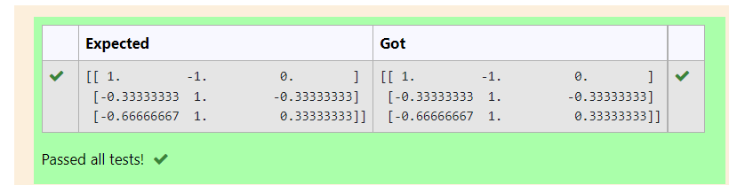

# INVERSE-OF-A-MATRIX
## Aim:
To write a python program to find the inverse of a matrix
## Equipment’s required:
1. 	Hardware – PCs
2. 	Anaconda – Python 3.7 Installation / Moodle-Code Runner
## Algorithm:
### Step1 :
import numpy as np
### Step 2: 
find the givem matrix
### Step 3: 
show linearalgrebraic
### Step 4:
print the solution 

## Program:
#Program to find the inverse of a matrix.
#Developed by :M .GUNASEKHAR
#RegisterNumber:21004955
import numpy as np
a = np.array([[2,1,1],[1,1,1],[1,-1,2]])
sol = np.linalg.inv(a)
print(sol)
## Output:

## Result:
Thus the inverse of given matrix is successfully solved using python program

